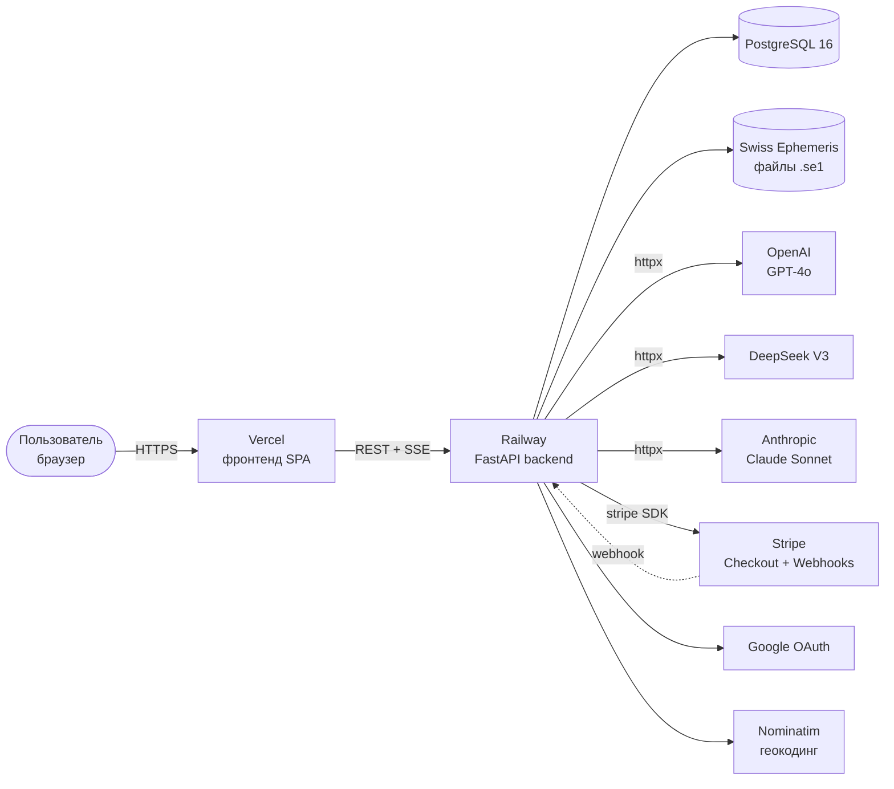
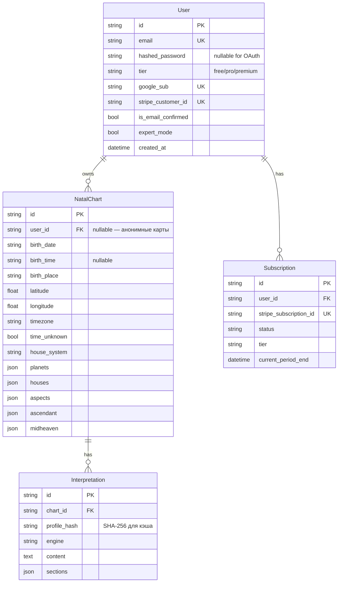
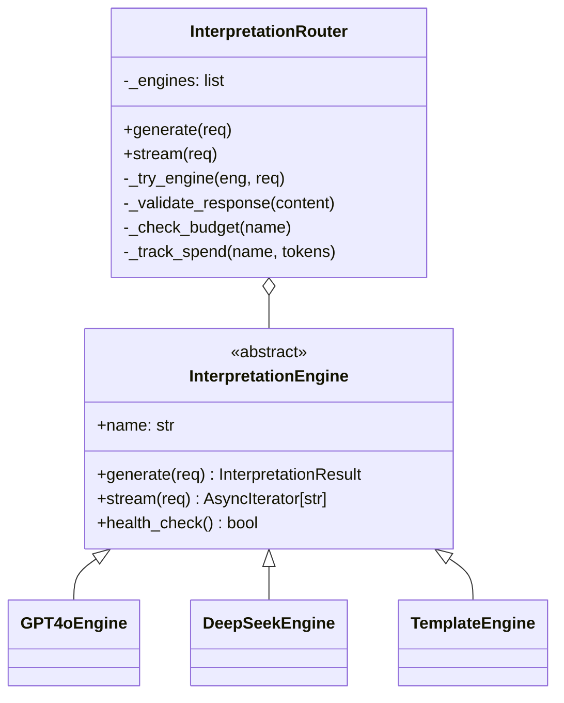
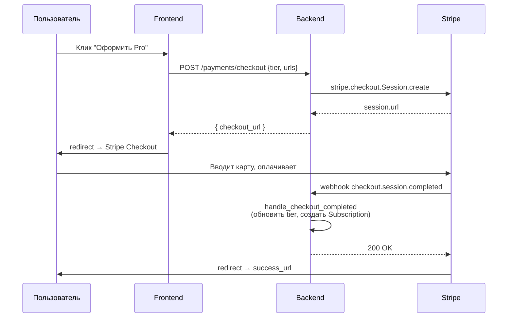
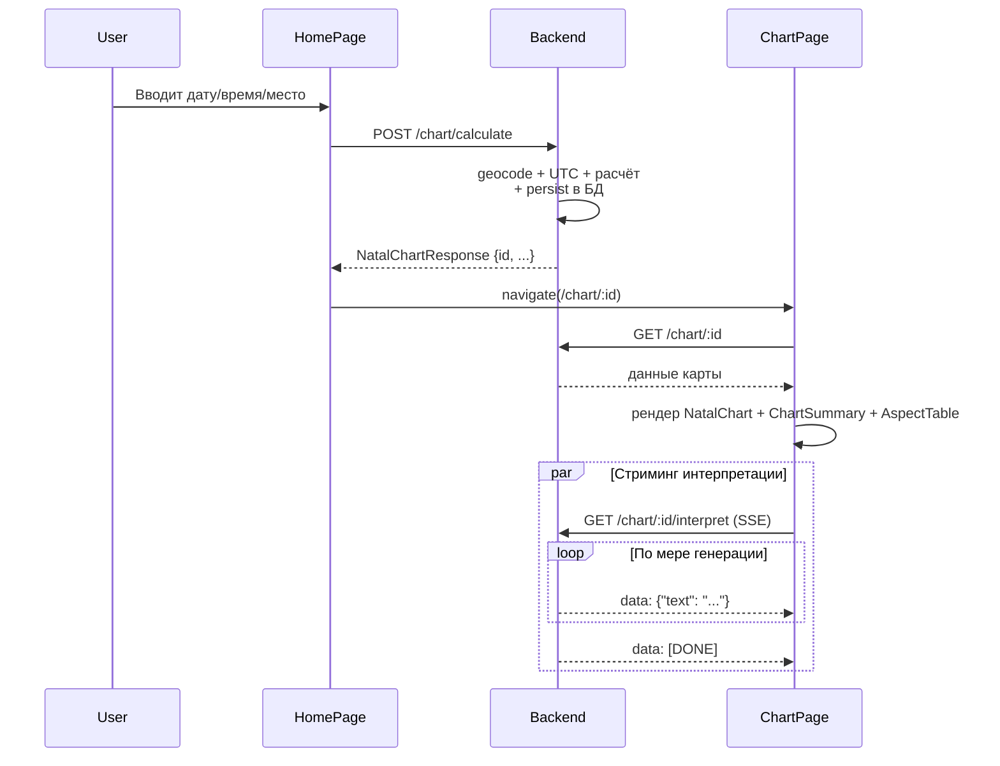
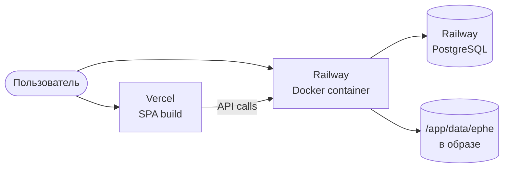
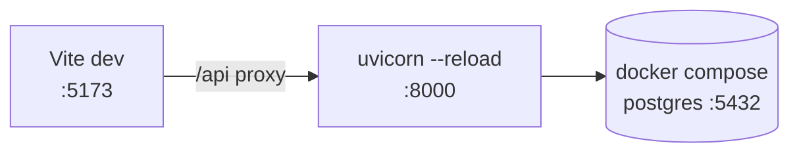

# Astro SPA — Архитектура проекта

Документ описывает текущую архитектуру системы: компоненты, потоки данных, технологический стек, инфраструктуру и пограничные решения. Источник истины — код в репозитории; документ обновляется вместе с ним.

## 1. Назначение и контекст

**Astro SPA** — веб-приложение для построения натальных карт, расчёта транзитов и генерации персональных астрологических интерпретаций с помощью LLM.

Целевая аудитория: пользователи без астрономической подготовки, которым нужны точные расчёты Swiss Ephemeris + связный человекочитаемый текст. Монетизация — подписочная модель (free / pro / premium) через Stripe.

Ключевые качества системы:

| Свойство | Реализация |
|---|---|
| Точность расчётов | Swiss Ephemeris через `pyswisseph`, погрешность < 1 угл. сек |
| Время отклика для текста | Server-Sent Events со стримингом по токенам |
| Устойчивость к сбоям LLM | Цепочка fallback: GPT-4o → DeepSeek → шаблонный движок |
| Контроль расходов на ИИ | Per-day budget tracker + per-tier rate limits |
| Безопасность аккаунтов | JWT (access + refresh) + Google OAuth + bcrypt |

## 2. Архитектура верхнего уровня



Система разбита на три слоя:

1. **Frontend** — статический React SPA (Vite + Tailwind). Обращается к API напрямую по HTTPS.
2. **Backend** — монолитное FastAPI-приложение, разбитое внутри на доменные модули. Stateless (кроме in-memory кэша и rate-limit счётчиков).
3. **Внешние сервисы** — БД, ephemeris-файлы, LLM-провайдеры, Stripe, Google OAuth, Nominatim.

## 3. Технологический стек

### Backend
- **Python 3.11+** (`pyproject.toml`)
- **FastAPI 0.111+** — асинхронный веб-фреймворк
- **SQLAlchemy 2.0** + **Alembic** — ORM и миграции
- **PostgreSQL 16** (через `psycopg2-binary`) — основное хранилище
- **pyswisseph 2.10+** — Swiss Ephemeris bindings
- **pydantic 2.7** + **pydantic-settings** — валидация и конфиг
- **python-jose[cryptography]** — JWT
- **passlib[bcrypt]** — хеширование паролей
- **slowapi** — rate limiting
- **httpx** — HTTP-клиент к LLM
- **timezonefinder** + **pytz** — часовые пояса
- **geopy** — Nominatim геокодинг

### Frontend
- **React 18.3** + **React Router 6.23**
- **Vite 5** — сборка
- **Tailwind 3.4** — стили
- **D3.js 7.9** — рендеринг колеса зодиака

### Инфраструктура
- **Docker / Docker Compose** — локальная разработка
- **Railway** — backend production (`astro-production-e070.up.railway.app`)
- **Vercel** — frontend production (`vercel.json` в репозитории)

## 4. Backend: доменные модули

Бэкенд разделён на доменные пакеты. Каждый пакет имеет (как правило) `router.py` с эндпоинтами и доменную логику в отдельных файлах.

```
backend/
├── main.py                     # FastAPI app, lifespan, CORS, общие эндпоинты
├── config.py                   # Pydantic Settings (env переменные)
├── database.py                 # SQLAlchemy engine, SessionLocal, Base, get_db
├── models.py                   # ORM: User, NatalChart, Interpretation, Subscription
├── schemas.py                  # Pydantic схемы запросов/ответов
├── cache.py                    # Thread-safe TTL-кэш + хэш профиля
│
├── ephemeris/                  # Расчётное ядро
│   ├── calculator.py           # Планеты, дома, ASC, MC через pyswisseph
│   ├── aspects.py              # Аспекты (0/60/90/120/180°) + орбы
│   ├── houses.py               # Системы домов
│   └── geo.py                  # Геокодинг + DST + валидация координат
│
├── interpretation/             # AI-интерпретация
│   ├── base.py                 # InterpretationEngine ABC
│   ├── router.py               # Fallback-цепочка + бюджет + кэш
│   ├── gpt4o.py                # OpenAI engine
│   ├── deepseek.py             # DeepSeek engine
│   ├── template.py             # Шаблонный движок
│   ├── prompts.py              # Сборка промптов
│   └── knowledge_base.json     # База шаблонных интерпретаций
│
├── transit/                    # Транзиты и прогнозы
│   ├── engine.py               # Поиск окон входа/выхода из орба + точный пик
│   ├── prompts.py              # Транзитные промпты
│   ├── forecast_prompt.py      # Daily/Weekly/Monthly промпты
│   └── weekly_endpoint.py      # (вспомогательный модуль)
│
├── calendar/                   # Общий астро-календарь (free tier)
│   └── engine.py               # Лунные фазы, ингрессы, аспекты медленных планет
│
├── auth/                       # JWT + OAuth + dependencies
│   ├── jwt.py                  # access (15м), refresh (7д), email-confirm (24ч)
│   ├── passwords.py            # bcrypt
│   ├── oauth.py                # Google OAuth code exchange
│   ├── dependencies.py         # get_current_user, require_tier
│   ├── rate_limits.py          # Per-tier ограничения
│   └── router.py               # /api/v1/auth/*
│
├── payments/                   # Stripe
│   ├── stripe_service.py       # Customer, Checkout, Portal, webhook handlers
│   └── router.py               # /api/v1/payments/*
│
├── profile/                    # Профиль пользователя
│   ├── router.py               # Карты, история, подписка, GDPR-удаление
│   └── settings_router.py
│
└── tests/                      # pytest + pytest-asyncio
```

### 4.1 Слой данных (`database.py`, `models.py`)

Используется sync-движок SQLAlchemy 2.0 (стиль DeclarativeBase). Подключение через `get_db()` как FastAPI Depends — открывает сессию на запрос, закрывает в finally.

**Сущности**:



Расчётные данные (планеты, дома, аспекты) хранятся в JSON-колонках — это упрощает запись и вывод, но исключает индексацию по содержимому. Для текущих сценариев (получить карту по id) этого достаточно.

UUID генерируются в Python (`uuid.uuid4()`), не на стороне БД — это даёт переносимость между Postgres и SQLite (используется в тестах через `test_astro.db`).

### 4.2 Расчётное ядро (`ephemeris/`)

`calculator.py` инициализирует Swiss Ephemeris путь один раз при импорте, опираясь на `EPHE_PATH`. Базовые блоки:

- `_calc_planet_position(planet_id, jd)` — обёртка над `swe.calc_ut`, обёрнутая в `lru_cache(maxsize=4096)`. Кэш работает по паре (planet_id, jd), JD округляется до 6 знаков.
- `calculate_planets(utc_dt)` — все планеты + Северный лунный узел (Mean Node).
- `calculate_houses(utc_dt, lat, lon, system)` — Placidus/Koch/Whole Sign/Equal. На полярных широтах (|lat| > 66°) Placidus автоматически даёт warning, при ошибке `swe.Error` — fallback на Equal.
- `assign_houses(planets, houses)` — определяет дом каждой планеты с учётом перехода через 0° Овна.
- `calculate_full_chart(...)` — оркестратор, возвращает `(FullChart, aspects)`.

Геокодинг (`geo.py`) использует Nominatim через `geopy`. Часовой пояс определяется через `timezonefinder` по координатам, а UTC рассчитывается с учётом DST через `pytz`. Неоднозначное время (например, во время осеннего перехода) приводит к `AmbiguousTimeError` с альтернативами — пользователь должен выбрать вариант.

### 4.3 AI-интерпретация (`interpretation/`)

Архитектура построена вокруг абстракции `InterpretationEngine` (ABC):



`InterpretationRouter` (singleton через `get_router()`) реализует:

1. **Cache lookup** — `interpretation_cache` (TTL 30 дней), ключ — SHA-256 от натального профиля.
2. **Fallback chain** — последовательно пробует GPT-4o → DeepSeek → шаблоны.
3. **Retry** — 3 попытки с экспоненциальной задержкой (1с, 3с, 9с) и таймаутом 30с на каждую.
4. **Budget guard** — `AI_DAILY_BUDGET_USD` ограничивает суммарные траты за день. Шаблонный движок не считается.
5. **Validation** — ответ должен быть ≥ 200 символов и содержать секционные маркеры. Если нет — пробуется следующий движок.
6. **Spend tracking** — `_daily_spend[date]` накапливает USD по фиксированным rate-картам (`_COST_PER_1K_TOKENS`).

`TemplateEngine` всегда работает (нет внешних зависимостей), что гарантирует — пользователь получает хоть какой-то ответ.

### 4.4 Транзиты (`transit/engine.py`)

Алгоритм поиска транзитов оптимизирован для UI с горизонтальной timeline. На каждом шаге сканирования (4 часа) для каждой пары (планета транзита × планета натала × тип аспекта) поддерживается состояние **окна**:

- При входе орба — открывается окно с `start_dt`
- Пока в орбе — обновляется `peak_orb` (минимум) и `last_dt`
- При выходе — окно закрывается, эмитится `TransitEvent` с тройкой `start_date / peak_date / end_date`

Точное время максимума ищется внутри `_find_exact_aspect` тернарным поиском (12 итераций) — это быстрее, чем стандартная бисекция, и даёт точность до минуты.

Дополнительные функции:
- `get_active_transits(events, on_date)` — фильтр по дате (для дневного прогноза)
- `get_planet_positions_for_date(query_date)` — позиции планет в моменте, чтобы фронт мог показать движение по колесу
- `get_transit_summary(events)` — топ-10 значимых событий по орбу

### 4.5 Аутентификация (`auth/`)

JWT токены трёх типов:

| Тип | TTL | Назначение |
|---|---|---|
| access | 15 минут | Авторизация API-запросов |
| refresh | 7 дней | Обмен на новую пару токенов |
| email_confirm | 24 часа | Подтверждение почты по ссылке |

Все токены подписываются `JWT_SECRET` (HS256), payload содержит `sub` (user_id), `email`, `tier`, `type`. `decode_token` различает access/refresh по `type`.

OAuth (Google) — стандартный flow: фронт получает `code`, бэк меняет его на `id_token` и `userinfo`, ищет пользователя по email или создаёт нового и связывает с `google_sub`.

Зависимость `get_current_user` извлекает Bearer-токен из заголовка, декодирует, грузит пользователя из БД, проверяет `is_active`. `require_tier(level)` дополнительно проверяет тариф для платных эндпоинтов.

### 4.6 Платежи (`payments/`)

Stripe интеграция работает через managed-flow:



Webhook принимает все три события (`checkout.session.completed`, `customer.subscription.updated`, `invoice.payment_failed`). Подпись проверяется через `stripe.Webhook.construct_event` с `STRIPE_WEBHOOK_SECRET`. На исключениях обработки возвращается 200, чтобы Stripe не уходил в бесконечный retry — но логируется через `logger.exception`.

Customer Portal даёт пользователю самостоятельно менять способ оплаты, отменять подписку и смотреть инвойсы — управление вынесено за пределы продукта.

### 4.7 Кэш (`cache.py`)

`TTLCache` — потокобезопасный dict с per-key TTL. Используются два инстанса:

- `interpretation_cache` (max 5000) — TTL 30 дней, ключ `interp:<sha256(profile)>`
- `transit_cache` (max 2000) — TTL 7 дней, ключ `transit:{chart_id}:{from}:{to}:{planet}:{orb}`

Интерфейс намеренно совпадает с `redis-py` (get/set/delete) — для будущей замены при горизонтальном масштабировании. Сейчас, поскольку backend деплоится одной репликой, in-memory достаточно.

### 4.8 Rate limiting

Два уровня:

1. **slowapi** на эндпоинтах (по IP) — `RATE_LIMIT_ANON` (30/мин) и `RATE_LIMIT_AUTH` (100/мин).
2. **Per-tier daily limits** — для free-тира: 5 карт/день, 2 интерпретации/день. Хранятся в БД или in-memory счётчиках (см. `auth/rate_limits.py`).

## 5. Frontend

### 5.1 Структура

```
frontend/
├── src/
│   ├── main.jsx                # ReactDOM root + BrowserRouter
│   ├── App.jsx                 # AuthProvider + Routes (/, /chart/:id)
│   ├── index.css               # Tailwind + CSS-переменные темы
│   ├── api/client.js           # REST + SSE
│   ├── pages/
│   │   ├── HomePage.jsx        # Форма ввода данных рождения
│   │   └── ChartPage.jsx       # Три вкладки: Карта / Транзиты / Планировщик
│   ├── components/
│   │   ├── BirthForm.jsx
│   │   ├── NatalChart.jsx      # D3.js SVG-колесо
│   │   ├── ChartSummary.jsx
│   │   ├── AspectTable*.jsx
│   │   ├── Interpretation.jsx  # SSE-стриминг
│   │   ├── TransitTimeline.jsx
│   │   ├── TransitEventDetail.jsx
│   │   ├── ForecastScale.jsx
│   │   ├── ExpertModeToggle.jsx
│   │   └── AstroCalendar.jsx
│   └── hooks/
│       └── useExpertMode.js
└── public/_redirects           # SPA fallback для Vercel/Netlify
```

В корне `frontend/` также лежат `LoginPage.jsx`, `RegisterPage.jsx`, `ProfilePage.jsx`, `PaymentSuccessPage.jsx`, `TransitsPage.jsx` — эти файлы пока не подключены в роутер `App.jsx` (там только Home и Chart).

### 5.2 API-клиент

`src/api/client.js` — централизованная точка обращения к бэкенду:

- `request(path, options)` — обёртка над `fetch` с обработкой ошибок (`ApiError`).
- `calculateChart`, `getChart`, `getTransits` — REST-вызовы.
- `streamInterpretation`, `streamTransitInterpretation` — `EventSource` для SSE с автоматической реконнекцией и распознаванием маркера `[DONE]`.
- `streamTransitEventInterpretation` — POST + ручное чтение через `ReadableStream` (т.к. EventSource не поддерживает POST).

`API_BASE` сейчас захардкожен на production-URL Railway — для локальной разработки это блокирует Vite-прокси из `vite.config.js`. Это известная техдолговая точка.

### 5.3 Поток данных (натальная карта)



## 6. Конфигурация (`config.py`)

Класс `Settings` на `pydantic-settings`. Все секреты — через `.env` (не в репозитории). Поля сгруппированы:

- БД: `DATABASE_URL`
- AI: `OPENAI_API_KEY`, `DEEPSEEK_API_KEY`, `AI_DAILY_BUDGET_USD`
- JWT: `JWT_SECRET`, TTL access/refresh
- Rate limits: anon, auth, free per-day лимиты
- Ephemeris: `EPHE_PATH`
- Stripe: secret, webhook secret, price ID per tier
- Google OAuth: client_id, client_secret
- Общие: `DEBUG`, `CORS_ORIGINS`

`@lru_cache` на `get_settings()` гарантирует один инстанс на процесс.

## 7. Деплой

### 7.1 Production



- **Frontend** билдится через `vite build`, статика разворачивается на Vercel. `vercel.json` настраивает SPA-fallback.
- **Backend** собирается из `Dockerfile` (Python 3.12-slim + gcc для сборки `pyswisseph`). Эфемериды копируются в образ. Запускается `uvicorn backend.main:app`.
- **PostgreSQL** — managed, `DATABASE_URL` от Railway.
- **Stripe webhook URL**: `https://<railway-domain>/api/v1/payments/webhook`.

### 7.2 Локальная разработка



`docker-compose.yml` поднимает только БД и (опционально) API. Frontend запускается отдельно через `npm run dev` для скорости HMR.

`start.bat` оркестрирует всё одной командой на Windows.

## 8. Сценарии (request flow)

### 8.1 Расчёт натальной карты

```
POST /api/v1/chart/calculate {birth_date, birth_time?, birth_place, house_system}
  → backend.ephemeris.geo.geocode_place(place) → Nominatim
  → validate_coordinates(lat, lon)
  → resolve_utc_datetime(date, time, tz) → pytz, обработка DST
  → backend.ephemeris.calculator.calculate_full_chart(utc_dt, lat, lon, system)
      → calculate_planets() → calculate_houses() → assign_houses()
      → calculate_aspects()
  → persist в natal_charts (JSON-колонки)
  → NatalChartResponse {id, planets, houses, aspects, ascendant, midheaven, warnings}
```

### 8.2 Стриминговая интерпретация

```
GET /api/v1/chart/{id}/interpret (Accept: text/event-stream)
  → загрузить chart из БД
  → собрать natal_profile dict
  → InterpretationRouter.stream(InterpretationRequest)
      → для каждого engine in [GPT4o, DeepSeek, Template]:
          → check budget
          → engine.stream(req) — async iterator чанков
          → SSE-обёртка: data: {"text": chunk}\n\n
          → при первом успехе — return
  → завершение: data: [DONE]\n\n
```

### 8.3 Транзиты + дневной прогноз

```
GET /api/v1/chart/{id}/forecast/daily?on_date=2026-05-17
  → calculate_transits(natal_planets, on_date-1, on_date+1) → список окон
  → get_active_transits(events, on_date) → активные на дату
  → build_daily_forecast_prompt(date, events, profile)
  → попытка 1: Anthropic Claude Sonnet (если ANTHROPIC_API_KEY)
  → попытка 2: OpenAI GPT-4o (если OPENAI_API_KEY)
  → parse_forecast_response(raw) → структурированный JSON
  → 503 если оба недоступны
```

## 9. Безопасность

- **Секреты** — только в `.env`, в код не попадают. `JWT_SECRET` в продакшене должен быть длинной случайной строкой (`secrets.token_urlsafe(64)`).
- **Пароли** — bcrypt через passlib.
- **CORS** — `CORS_ORIGINS` в продакшене — конкретный домен фронтенда, не `*`.
- **Stripe webhook** — обязательная проверка подписи `stripe-signature` через `construct_event`.
- **JWT** — короткоживущий access + ротируемый refresh.
- **GDPR** — `DELETE /api/v1/auth/me` (полное удаление аккаунта с каскадом) и `DELETE /api/v1/profile/data` (удаление данных без удаления учётки).
- **Rate limiting** — slowapi на IP + per-tier daily limits.
- **SQL injection** — все запросы через SQLAlchemy ORM, без raw SQL (кроме `SELECT 1` в `/health/db`).

## 10. Наблюдаемость

- Логи через стандартный `logging`, неймспейсы `astro`, `astro.auth`, `astro.payments`, `astro.router`, `astro.transit`, `astro.profile`.
- `/health` — liveness
- `/health/db` — readiness (SELECT 1)
- `/health/ai` — статус всех движков и текущий дневной расход в USD

Метрик и трейсинга пока нет — это техдолг для production-нагрузки.

## 11. Тестирование

`pytest` + `pytest-asyncio`. Тестовая БД — SQLite (`test_astro.db`) для скорости. Покрытие модулей:

| Тест | Что покрывает |
|---|---|
| `test_ephemeris.py` | Точность расчётов на эталонных картах |
| `test_validation.py` | Pydantic-валидация входных данных |
| `test_api.py` | Smoke-тесты эндпоинтов |
| `test_auth.py` | Регистрация, логин, refresh, JWT |
| `test_interpretation.py` | Маршрутизация и fallback |
| `test_transits.py` | Окна транзитов |
| `test_payments.py` | Stripe webhook handlers |
| `test_profile.py` | Профильные эндпоинты |

## 12. Известные особенности и техдолг

| Точка | Замечание |
|---|---|
| `frontend/src/api/client.js` | `API_BASE` захардкожен на Railway URL → ломает Vite proxy в dev |
| `.env.example` | Содержит реальный (или похожий на реальный) `OPENAI_API_KEY` — рекомендуется вычистить и отозвать |
| `frontend/*.jsx` в корне | LoginPage, RegisterPage, ProfilePage, PaymentSuccessPage, TransitsPage не подключены в роутер |
| `backend/calendar/engine.py` | Реализован, но эндпоинт в `main.py` не виден (стоит проверить include_router) |
| Корневой каталог | `engine.py`, `client.js`, `natal_pdf.py`, `54.txt`, `замечания.txt`, `образец.txt`, `test_astro.db` — выглядят как временные/рабочие артефакты рядом с прод-кодом |
| Кэш | In-memory — при горизонтальном масштабировании потребуется Redis |
| Метрики | Отсутствуют — Prometheus/OpenTelemetry стоит добавить перед ростом нагрузки |

---

**Версия документа**: 1.0
**Соответствует коду на**: май 2026
**Поддерживается**: вместе с обновлениями структуры проекта.
